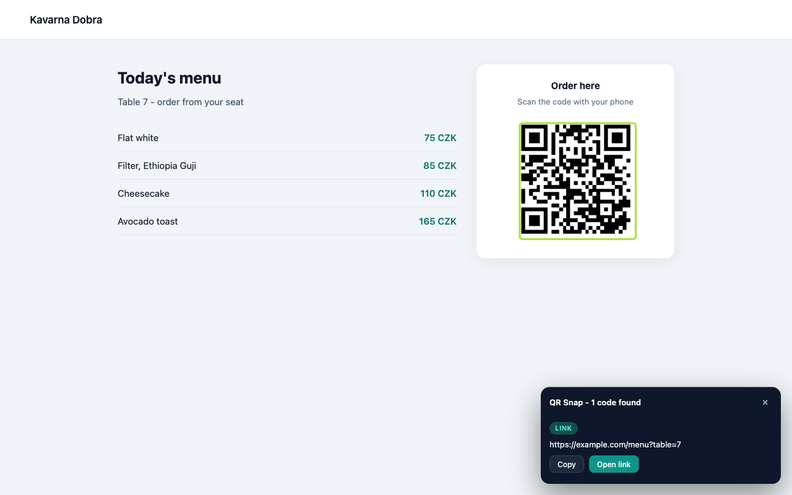
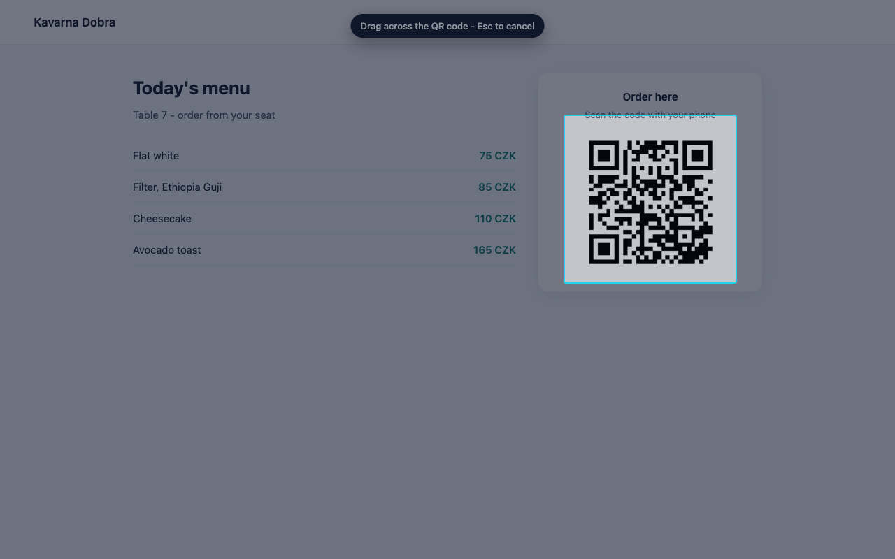
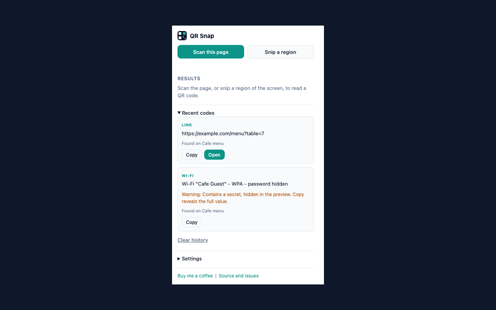

# QR Snap

Read QR codes that are already on your screen. No phone, no camera, no upload.

QR Snap screenshots the tab you are looking at, decodes every QR code it can find, and checks
the payload before you open it. It also has a snipping tool for codes that live inside a canvas,
a PDF, a video call or a screenshot someone pasted into a chat.



## Two ways in

**Scan this page** - one click decodes every QR code on the visible tab. Turn on the full-page
option and it scrolls through the document, scanning as it goes. Found codes get outlined on the
page and listed in the popup.

**Snip a region** - drag a rectangle over anything on screen. The selection is upscaled before
decoding, so small codes still read.



Both are also on the right-click menu (page, and directly on an image), and on keyboard
shortcuts: `Alt+Shift+Q` opens the popup, `Alt+Shift+S` starts a snip.



## Reads more than links

Links, Wi-Fi network cards, contact cards (vCard and MECARD), calendar events, email, phone,
SMS, map locations and authenticator setup codes are recognised and labelled.

## Checks the payload before you open it

A QR code is a link you cannot read with your eyes, so QR Snap reads it for you first:

- warns about plain `http`, punycode or non-ASCII host names, raw IP hosts and
  `user:password@host` phishing URLs
- refuses to open anything that is not `http` or `https` - the check is repeated in the service
  worker, not just in the UI
- hides Wi-Fi passwords and `otpauth` secrets in the preview; **Copy** still gives the exact value
- renders every decoded string with `textContent`, never `innerHTML`

## Install

From source, until the Chrome Web Store listing is live:

1. Clone this repository
2. Open `chrome://extensions` and enable **Developer mode**
3. **Load unpacked** and select the repository folder
4. Open a page with a QR code and click the toolbar icon

## Why it screenshots instead of reading the DOM

Canvas, WebGL, cross-origin images and PDF previews cannot be read out of a page without
tainting errors or broad host permissions. Capturing the visible tab works for all of them,
needs only `activeTab`, and matches exactly what the user can see.

Decoding runs in three passes: the whole frame, then every image-like element cropped and
upscaled to at least 420 px on its short side, then a 3x3 grid of overlapping tiles as a
fallback. A single scale factor (`capture width / viewport width`) maps results back to page
coordinates, which is what makes the outlines land correctly under zoom and on HiDPI screens.

## Permissions

| Permission | Why |
| --- | --- |
| `activeTab` | capture the visible tab when you ask for a scan |
| `scripting` | draw the selection rectangle, outlines and result panel in the page |
| `contextMenus` | the three right-click entries |
| `storage` | your settings and the optional local history |
| `clipboardWrite` | the Copy button |

No host permissions. No remote code - the decoder ([jsQR](https://github.com/cozmo/jsQR),
Apache-2.0) is bundled in `vendor/`.

## Development

```bash
node --test 'tests/*.test.mjs'   # unit tests for payload classification and safety warnings
node scripts/verify.mjs          # manifest and referenced-asset preflight
node scripts/make-icons.mjs      # regenerate icons and the store promo tile
bash scripts/package.sh          # verify + test + build dist/qr-snap-<version>.zip
npx @biomejs/biome@2.4.7 check . # lint and format
```

CI runs all of the above on every push and uploads the packaged zip as an artifact.

## Layout

```
manifest.json          MV3 manifest, activeTab only, no host permissions
src/background.js      service worker: menus, commands, message routing
src/shared/scanner.js  capture orchestration, scroll-through, coordinate mapping
src/shared/decode.js   OffscreenCanvas crops + jsQR, upscales small codes
src/shared/qrValue.js  payload classification and phishing warnings (unit tested)
src/shared/history.js  settings and the local 50-entry history
src/content/overlay.js snip selector, result toast, on-page outlines (shadow DOM)
src/popup/            toolbar popup
vendor/jsQR.js        bundled decoder, Apache-2.0
scripts/              icon generation, preflight, store packaging
store/                listing copy, promo tile, publishing walkthrough
docs/                 GitHub Pages site and the privacy policy
```

## Known limits

- `chrome://` pages, the Web Store and other browser pages cannot be scanned - Chrome forbids it
- Full-page scan stops after 12 viewport captures (Chrome throttles tab capture to 2 per second)
- Codes under roughly 60 px on screen read better after zooming in, or via the snip tool

## Publishing

`store/publishing.md` is the full Chrome Web Store walkthrough - developer account, every tab in
the dashboard, screenshots, updates, and the rules around the donation link. `store/listing.md`
holds the listing copy and permission justifications.

## Privacy

Nothing leaves your browser: no account, no analytics, no server. The optional history of the
last 50 codes is stored locally and can be cleared from the popup. Full text in
[docs/privacy-policy.md](docs/privacy-policy.md).

## Support

QR Snap is free and MIT-licensed. If it saved you a trip to your phone,
[buy me a coffee](https://buymeacoffee.com/maacaa0). Nothing in the extension is gated behind it.

## License

MIT - see [LICENSE](LICENSE). Bundles jsQR under the Apache License 2.0
(`vendor/jsQR-LICENSE.txt`).
